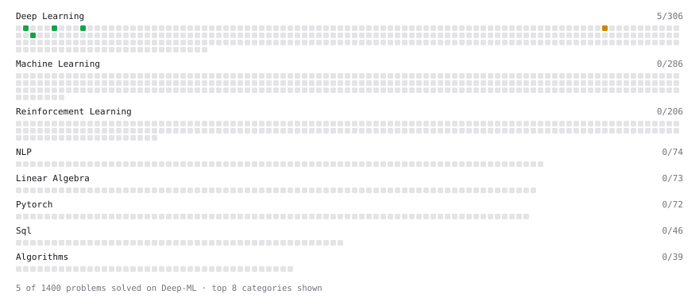

# Deep-ML

My machine learning practice from [Deep-ML](https://www.deep-ml.com). Every solution here was written by hand.

**4** solved · 4 problems · 0 labs · 0 math

[**Browse the interactive portfolio**](https://usbali.github.io/deep-ml/) to replay this filling in over time.

## Problems

| | Difficulty | Solved | |
| --- | --- | --- | --- |
| [Implementation of Log Softmax Function](https://www.deep-ml.com/problems/39) | easy | 2026-09-15 | [solution](problems/0039-implementation-of-log-softmax-function) |
| [Leaky ReLU Activation Function](https://www.deep-ml.com/problems/44) | easy | 2026-09-16 | [solution](problems/0044-leaky-relu-activation-function) |
| [Softmax Activation Function Implementation ](https://www.deep-ml.com/problems/23) | easy | 2026-09-15 | [solution](problems/0023-softmax-activation-function-implementation) |
| [Implement INT8 Quantization](https://www.deep-ml.com/problems/294) | medium | 2026-09-15 | [solution](problems/0294-implement-int8-quantization) |

---

_This file is regenerated by Deep-ML on every push._
